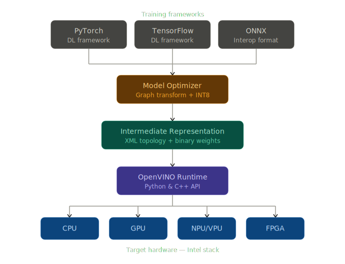

# OpenVINO

> **Open-source inference toolkit by Intel** — optimize and deploy deep learning models faster on Intel hardware.

---

## What is OpenVINO?

OpenVINO is an open-source inference toolkit developed by Intel to optimize and deploy deep learning models on a wide range of hardware, including Intel CPUs, integrated GPUs, NPUs/VPUs, and FPGAs.

It focuses exclusively on **inference** (not training) for workloads such as:
- Computer vision
- Speech recognition
- Natural language processing
- Generative models

> **Inference** is the phase where a trained model is used to make predictions — e.g., giving a model a new image and getting back "cat", "car", or "person". OpenVINO makes this prediction step faster, more efficient, and suitable for real-world production environments.

---

## How It Works

OpenVINO takes a model trained in a major framework and converts it into an optimized representation that runs efficiently on supported devices.

### Typical Workflow

```
1. Train your model in PyTorch, TensorFlow, or export to ONNX
        ↓
2. Convert using the OpenVINO Model Optimizer → Intermediate Representation (IR)
        ↓
3. Load the IR model via the OpenVINO Runtime API (Python or C++)
        ↓
4. Run inference on target device (CPU, GPU, NPU, FPGA)
```

This decouples training (framework-specific) from deployment (OpenVINO runtime), allowing the same model to be reused across different Intel platforms.

---

## Internal Components

### Model Optimizer
- Command-line tool that converts and optimizes models into IR (graph + weights)
- Applies graph transformations, constant folding, operator fusion, and shape inference
- Can enable quantization (e.g., INT8)
- Removes unnecessary computations and restructures the model for faster inference

### Intermediate Representation (IR)
- Consists of an **XML file** (network topology) and a **binary file** (weights)
- Hardware-agnostic — the same IR can run on multiple device types
- Write once, deploy anywhere (within Intel hardware)

### Runtime / Inference Engine
- Library exposing **C++ and Python APIs**
- Loads IR or supported formats (including ONNX in recent versions)
- Manages devices, memory, and execution
- Supports synchronous and asynchronous inference, batching, and multi-device execution

---

## Why Inference is Fast

OpenVINO accelerates inference through:

| Technique | Description |
|---|---|
| **Graph optimization** | Removes redundant operations, merges layers (operator fusion) |
| **Quantization (INT8)** | Reduces numerical precision for faster, lighter computations |
| **Hardware-aware execution** | Utilizes CPU vector instructions, GPU acceleration, or NPUs |
| **Parallelism** | Executes multiple operations simultaneously |
| **Memory optimization** | Reduces data movement and improves cache usage |

In simple terms, OpenVINO makes the model **smaller**, **simpler**, and **better adapted to the hardware**, leading to lower latency and higher throughput.

---

## Implementation

OpenVINO is primarily developed in **C++** for high performance, low latency, and efficient memory management.

| Layer | Language | Use Case |
|---|---|---|
| Core engine, device plugins, optimizations | C++ | Low-level hardware interaction, SIMD instructions |
| Python bindings (API) | Python | Experimentation, prototyping, ML workflow integration |
| Production API | C++ | Performance-critical, low-latency applications |

---

## Supported Platforms

### Programming Languages
- Python (API)
- C++ (API)

### Operating Systems
- Linux (Ubuntu, etc.)
- Windows

### Hardware
- Intel CPUs (Core, Xeon, Atom, etc.)
- Intel integrated GPUs (UHD, Iris, Xe, Arc)
- Intel NPUs/VPUs (Movidius, newer integrated NPUs)
- Selected Intel FPGAs (via dedicated plugins)

### OpenVINO Compatibility Notes
 
- AMD CPUs: OpenVINO runs on AMD CPUs (e.g., Ryzen 5 PRO) but is not officially supported by Intel.
In practice it works fine, though without the specific optimizations reserved for Intel hardware.
- GPU Support: OpenVINO has no native backend for NVIDIA or AMD GPUs.
On a mixed system, it will only leverage the Intel CPU (or Intel integrated GPU/NPU if available).
 
> Dedicated NVIDIA or AMD GPUs require separate runtimes such as CUDA, TensorRT, or ONNX Runtime with a CUDA provider.
---

## Advantages

- **Strong CPU optimization**: Substantial speedups on Intel CPUs compared to unoptimized framework runtimes, especially with quantization and graph optimizations
- **Broad model support**: Supports PyTorch, TensorFlow, ONNX, TFLite, and more via conversion
- **Device flexibility**: Target CPU, integrated GPU, NPU/VPU, and FPGA from a single runtime API
- **Edge and on-prem friendly**: Works without cloud dependencies; suitable for privacy-sensitive or resource-constrained environments
- **Efficient real-time inference**: Well-suited for video analytics, object detection, and interactive AI systems

---

## Limitations

- **Intel-centric**: No native backend for NVIDIA or AMD GPUs; limited usefulness in GPU-centric infrastructures
- **Extra conversion step**: Requires a conversion/optimization pipeline (Model Optimizer → IR) that adds complexity
- **Learning curve**: Developers must understand supported ops, conversion constraints, and device configuration
- **Fewer community examples**: Outside computer vision, fewer ready-made tutorials than mainstream runtimes

---

## Alternatives

| Tool | Best For |
|---|---|
| **NVIDIA TensorRT** | Maximum throughput/latency on NVIDIA GPUs (CUDA-enabled hardware) |
| **ONNX Runtime** | Vendor-agnostic deployment across different hardware ecosystems |
| **TensorFlow Lite** | Mobile and embedded devices (Android, iOS, edge) in the Google/TF ecosystem |

Each tool solves the same problem, running inference efficiently, but is tuned for different hardware and deployment scenarios. OpenVINO is primarily optimized for the **Intel stack**.

---

## Summary

```
Inference  =  using a trained model to make predictions
OpenVINO   =  making those predictions faster and more efficient on Intel hardware
```
 
---

## References

Intel. (2024). About OpenVINO (Version 2024) [Documentation]. OpenVINO. https://docs.openvino.ai/2024/about-openvino.html
 
Intel. (2025). Supported devices [Documentation]. OpenVINO. https://docs.openvino.ai/2025/documentation/compatibility-and-support/supported-devices.html
 
Intel. (n.d.). System requirements [Documentation]. OpenVINO. https://docs.openvino.ai/systemrequirements
 
OpenVINO Toolkit. (n.d.). OpenVINO™ is an open source toolkit for optimizing and deploying deep learning models [Repository]. GitHub. https://github.com/openvinotoolkit/openvino
 
Viso.ai. (2023, January 19). OpenVINO Toolkit: Optimize AI on Intel hardware. Viso Suite Blog. https://viso.ai/computer-vision/intel-openvino-toolkit-overview/
 
Datatonic. (2020, September 6). Optimising machine learning inference with Intel's OpenVINO. Datatonic Blog. https://datatonic.com/insights/machine-learning-inference-intel-openvino/
 
Uplatz. (2025, October 30). A comparative analysis of modern AI inference engines for optimized cross-platform deployment: TensorRT, ONNX Runtime, and OpenVINO. Uplatz Blog.
 
NVIDIA Corporation. (n.d.). NVIDIA TensorRT [Documentation]. NVIDIA. https://developer.nvidia.com/tensorrt
 
Microsoft. (n.d.). ONNX Runtime [Documentation]. Microsoft. https://onnxruntime.ai
 
Google. (n.d.). TensorFlow Lite [Documentation]. TensorFlow. https://www.tensorflow.org/lite